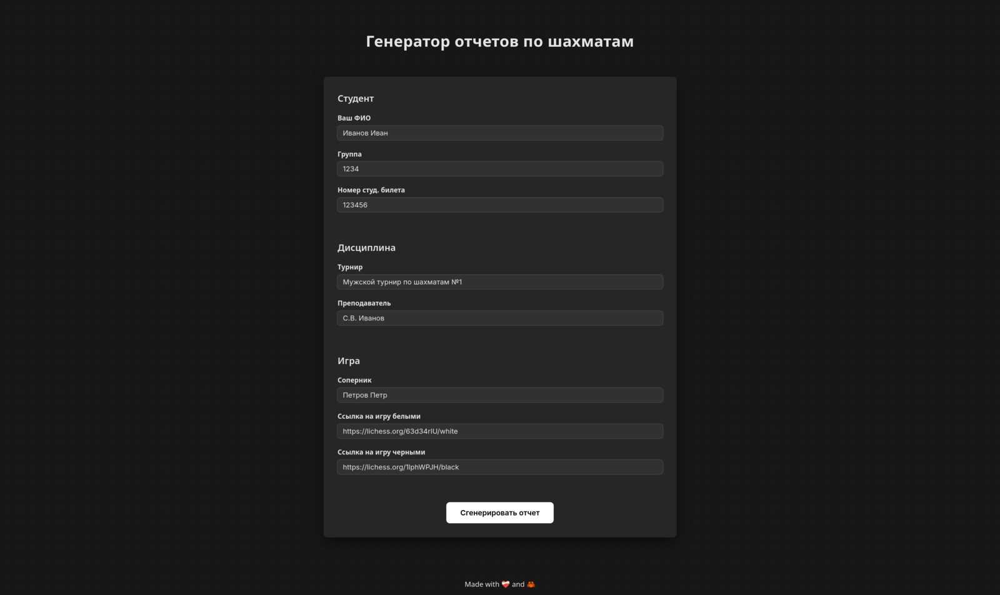

# lichess-xlsx-reports

Генератор отчетов по шахматам для кафедры ФВиС СПБГЭТУ "ЛЭТИ".




## Установка

Вы можете использовать
[публичный экземпляр сервиса](https://lichess-xlsx-reports-latest.onrender.com/)
или запустить сервис локально. Первоначальная загрузка публичного экземпляра
может занимать около минуты.

Ниже описаны шаги для локальной установки и запуска.

### 1. Docker/Podman

1.  Запустите контейнер

    ```sh
    # Загрузите образ
    docker pull ghcr.io/shelepuginivan/lichess-xlsx-reports:latest    # или podman

    # Запустите сервис
    docker run --rm -p 8000:8000 ghcr.io/shelepuginivan/lichess-xlsx-reports:latest
    ```

2.  Откройте http://localhost:8000 в браузере

### 2. Rust/Cargo

Для того, чтобы запустить сервис напрямую, требуется установить тулчейны Rust.
См. [`rustup`](https://rustup.rs/).

1.  Склонируйте репозиторий

    ```sh
    git clone https://github.com/shelepuginivan/lichess-xlsx-reports.git
    ```

2.  Запустите сервис

    ```sh
    cd lichess-xlsx-reports
    cargo r --release
    ```

3.  Откройте http://localhost:8000 в браузере


## Использование

1.  Заполните все поля формы
2.  Нажмите "Сгенерировать отчет"
3.  Если все поля были заполнены верно, отчет в формате XLSX будет скачан
    автоматически, в противном случае появится сообщение об ошибке

См. [пример отчета](./.github/assets/example.xlsx).

### Ссылки на игры

Обратите внимание на поля со ссылками:

- В поле **"Ссылка на игру белыми"** вставьте ссылку на игру, в которой **вы**
  играли белыми
- В поле **"Ссылка на игру черными"** вставьте ссылку на игру, в которой **вы**
  играли черными

Сервис поддерживает разные форматы ссылок на игру. Ниже приведены
поддерживаемые форматы с примерами.

1.  Ссылка на страницу игры (с длинным ID): `https://lichess.org/fFvoFPd1sAGr`
2.  Ссылка на страницу анализа: `https://lichess.org/fFvoFPd1`
3.  Ссылка с цветом фигур: `https://lichess.org/fFvoFPd1/white`, `https://lichess.org/fFvoFPd1/black`

Обычно достаточно скопировать ссылку на игру из браузера и вставить её в форму
— с большой долей вероятности сервис её распознает.

### Автосохранение полей

Следующие поля сохраняются после генерации отчета и автоматически заполняются
при повторном использовании сервиса:

- ФИО
- Группа
- Номер студ. билета
- Турнир
- Преподаватель

**Все данные хранятся локально в вашем браузере и не сохраняются на сервере.**


## Лицензия

Исходный код распространяется под лицензией [Unlicense](./LICENSE.md) и
является общественным достоянием.

Иконка сервиса взята с Flaticon: https://www.flaticon.com/free-icon/pen_10211061.
